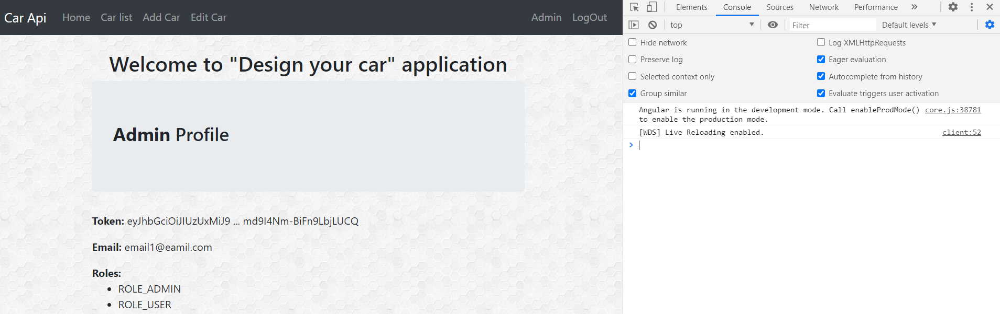
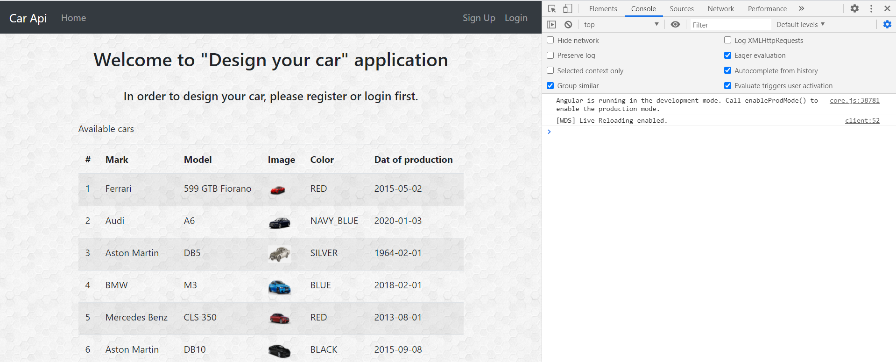
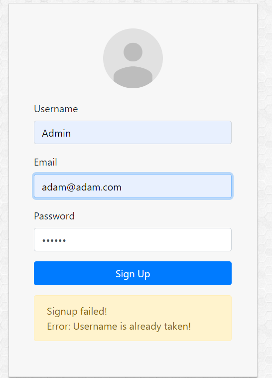
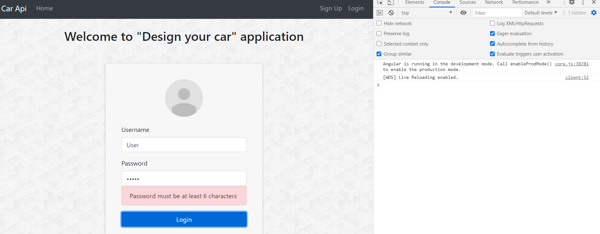
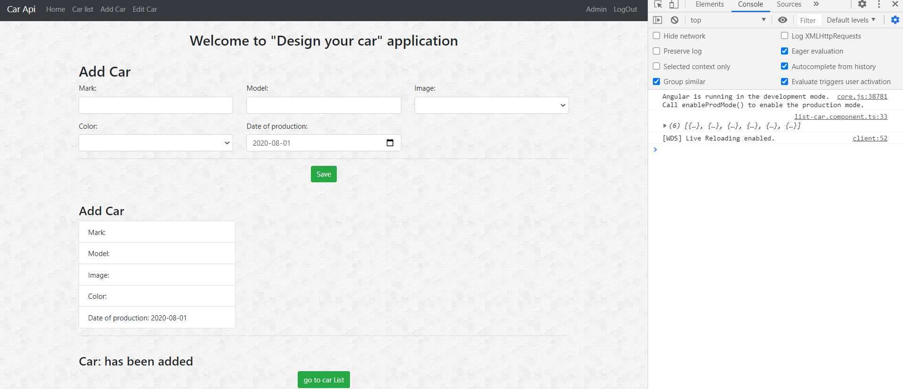
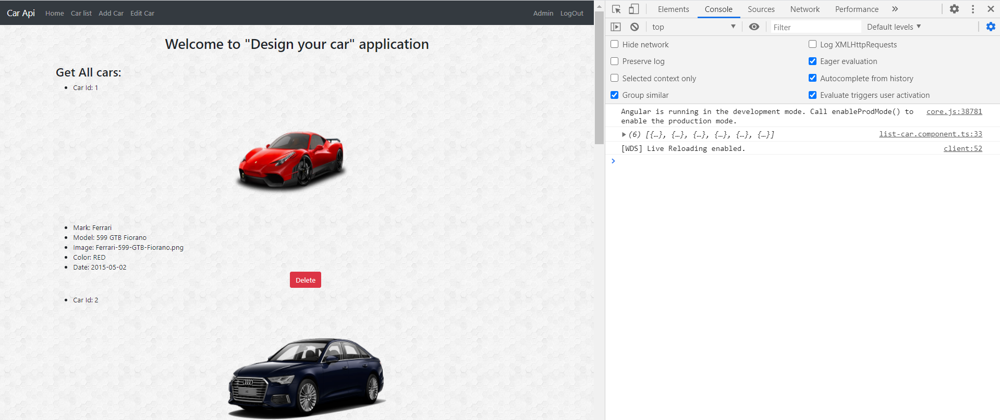
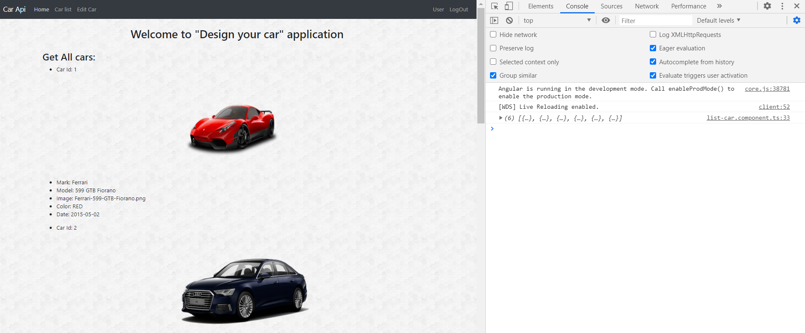
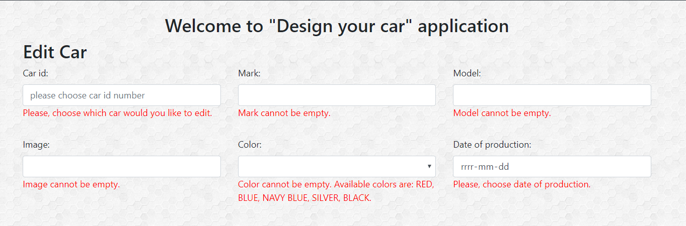

"Design car" prototype application. This part of the application is connected with the backend: 
https://github.com/Iwona007/design-car-angular Please go to the above http address to be able to 
read about what technology was used in the backend. There also are information on how to use this 
application in Java and Spring Boot.

<!-- This application has been deployed on heroku: https://design-car-angular.herokuapp.com/home 

Please be patient for Heroku because when the application is not in use, it enters sleep mode. 
So that mean when users go to the above address they need to wait a little bit longer for the 
first time. Moreover, data from the database needs more time to load so please try to refresh the 
website till data comes up.  -->

Used technology: 
Angular CLI 8.3.21
Typescript 3.5.3
Bootstrap 4
HTML
CSS

Tests have been conducted via Google Chrome and Mozilla FireFox Browsers. 

This application has been created in order to enjoy designing cars. Users can play with different 
attributes such as: Mark, model, color, image and date of production. It is recommended to mix this 
elements e.g: users can edit car with id number 1 and change mark, model, color, image and date for 
these value which he/she would like to receive. In other words they can create an Aston Martin G3 with 
the appearance of a classic, navy-blue Rolls Royce and date of production 1989. And as a result users 
are able to receive his/her car prototype.

This part of the description shows only how to use this application in Angular without the backend.

At first, on the menu users will see menu according to role or lack of this role. Users without any 
privilege will see Car Api, Home, and the opportunity to register or login.
For admin it will be: Car Api, Home, Car list, Add Car, Edit Car, Admin and LogOut. 
For user role it will be: Car Api, Home, Car list, Edit Car, User and LogOut.

If we go to the endpoint /home all users are able to see all cars list even if the user is not logged in 
or registered. This list show sum up all cars.

Secondly, this application has two users already in database: an "Admin" and a "User" with different 
permission. For instance users with user role have fewer privileges than admin role 

In this application users are allowed to: 
get all car => endpoint: /list-car. 
edit car which has been found by id => endpoint: /edit-car and. After edit car at the button of the page 
information about edit car and button "go to list" show. This allows to come back to the car list and see 
a result. Methods for these endpoints are in separated components: add-car.components.ts and edit-car.component.ts 
These methods/endpoints are the same for user and admin role.

Thirdly, the admin role has wider privilege than the user. Additionally, for admin privilege car-list has 
additional method to delete car based on id. Moreover, when the car is deleted, at the bottom of the page 
is a button for refresh page and show: get all car => endpoints: /list-car. 
Also methods for deleteCarById is in add-car.component.ts

Next add car => endpoint: /add-car method for this action also is in add-car.component.ts. 
When car has been added correctly users are able to see information about this and button which allows to 
go to all car list under /list-car endpoint.

Please be aware that "Token" information in admin and user panel is only to show haw the application works. 
All credentials and sensitive information should be stored in a safe place and not be exposed on the website.

Images from tests which I executed are stored in src/assets/img. 
In here I have attached only a couple of them and I invite you to see more in mentioned folder. 
All images have result in developer console.

image for admin profile:

image for home:

images for register validation:

images for login validation:

images for add car method:

images for car list admin view:

images for car list user view:

images for edit car validation:

